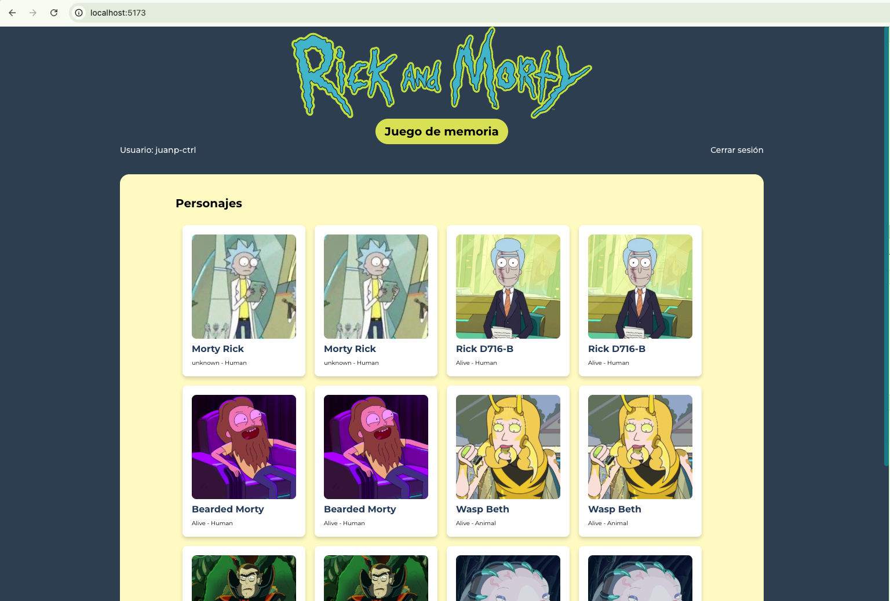

# 🎮 Rick and Morty Memory Game

Un juego de memoria interactivo desarrollado con React y TypeScript que utiliza personajes de la serie Rick and Morty. Los jugadores deben encontrar parejas de cartas mientras compiten por el menor número de turnos.



## 🏗️ Enfoque de Desarrollo

### Arquitectura del Proyecto

El proyecto está estructurado siguiendo el patrón **Atomic Design** lo que proporciona una organización escalable y mantenible:

```
src/
├── components/
│   ├── atoms/           # Componentes básicos reutilizables
│   ├── molecules/       # Combinaciones de átomos
│   └── organisms/       # Componentes complejos de negocio
│
├── hooks/               # Custom hooks para lógica de negocio
├── services/            # Capa de servicios para APIs
├── adapters/            # Adaptadores para APIs externas
├── contexts/            # Contextos de React para estado global
├── types/               # Definiciones de TypeScript
└── utils/               # Utilidades y helpers
```

### Principios de Desarrollo

1. **Separación de Responsabilidades**: Cada capa tiene una responsabilidad específica
2. **Composición sobre Herencia**: Uso extensivo de composition patterns
3. **Type Safety**: TypeScript estricto en toda la aplicación
4. **Performance First**: Optimizaciones de rendering y caching
5. **Accesibilidad**: Componentes accesibles con ARIA labels y navegación por teclado

## 🛠️ Decisiones Técnicas y Razonamiento

### ¿Por qué React Query?

**React Query** (@tanstack/react-query) fue elegido por las siguientes razones:

1. **Gestión de Estado del Servidor**: Maneja automáticamente el estado de las peticiones HTTP (loading, error, success)
2. **Caching Inteligente**: Cache automático con invalidación y revalidación
3. **Optimistic Updates**: Actualizaciones optimistas para mejor UX
4. **Background Refetching**: Refresco automático de datos en background
5. **Error Handling**: Manejo robusto de errores con retry automático

```typescript
// Configuración optimizada en App.tsx
const queryClient = new QueryClient({
  defaultOptions: {
    queries: {
      retry: 3, // 3 reintentos automáticos
      staleTime: 5 * 60 * 1000, // 5 minutos de datos frescos
      gcTime: 10 * 60 * 1000, // 10 minutos en cache
      refetchOnWindowFocus: false, // No refetch al cambiar focus
    },
  },
});
```

### ¿Por qué el Custom Hook useMemoryGame?

El hook `useMemoryGame` encapsula toda la lógica compleja del juego:

1. **Separación de Responsabilidades**: Separa lógica de UI de lógica de negocio
2. **Reutilización**: Puede ser usado en diferentes componentes
3. **Testing**: Fácil de testear de forma aislada
4. **Estado Complejo**: Maneja múltiples estados interdependientes

```typescript
// Características principales del hook:
- Estado del juego (cartas, movimientos, tiempo)
- Lógica de emparejamiento de cartas
- Temporizadores y delays
- Sistema de puntuación
- Gestión de estados de loading
```

### Arquitectura de Componentes

#### Átomos (Atoms)

- **Button**: Botón reutilizable con variantes y estados
- **Input**: Campo de entrada con validación
- **CharacterCard**: Carta de personaje con animaciones 3D

#### Moléculas (Molecules)

- **LoginForm**: Formulario de autenticación completo

#### Organismos (Organisms)

- **MemoryGame**: Componente principal del juego

### Sistema de Types

TypeScript proporciona:

- **Type Safety**: Prevención de errores en tiempo de compilación
- **IntelliSense**: Autocompletado mejorado
- **Refactoring Seguro**: Cambios seguros en toda la aplicación
- **Documentación Viva**: Los tipos sirven como documentación

## 🔐 Mantenimiento de Sesión Activa

### Estrategia de Autenticación

La aplicación implementa un sistema de autenticación mock con persistencia:

1. **Context API**: `AuthContext` maneja el estado global de autenticación
2. **localStorage**: Persiste token y datos de usuario
3. **Validación**: Validación de tokens y estructura de datos
4. **Recuperación Automática**: Restaura sesión al recargar la página

```typescript
// Flujo de autenticación:
1. Usuario ingresa credenciales
2. authenticateUser() simula llamada a API
3. Datos se guardan en localStorage
4. Context actualiza estado global
5. Al recargar, se recupera automáticamente la sesión
```

### Seguridad

- **Validación de Tokens**: Verificación de formato y estructura
- **Sanitización**: Limpieza de datos de entrada
- **Error Handling**: Manejo seguro de datos corruptos
- **Logout Seguro**: Limpieza completa de datos de sesión

## 🚀 Instrucciones para Ejecutar el Proyecto

### Prerrequisitos

- Node.js 18+
- pnpm (recomendado) o npm/yarn

### Instalación y Ejecución

```bash
# 1. Clonar el repositorio
git clone <repository-url>
cd RickAndMortyGame

# 2. Instalar dependencias
pnpm install

# 3. Ejecutar en modo desarrollo
pnpm dev

# 4. Abrir navegador en http://localhost:5173
```

### Scripts Disponibles

```bash
pnpm dev      # Servidor de desarrollo
pnpm build    # Build para producción
pnpm preview  # Preview del build
pnpm lint     # Linting con ESLint
```

### Credenciales de Acceso

El sistema de autenticación es **mock**, acepta cualquier credencial con:

- Usuario: mínimo 3 caracteres
- Contraseña: mínimo 4 caracteres

Ejemplos válidos:

- Usuario: `rick`, Contraseña: `1234`
- Usuario: `morty`, Contraseña: `portal`

## 🎯 Funcionalidades Implementadas

### ✅ Requisitos Cumplidos

- [x] **Autenticación**: Sistema de login con tokens
- [x] **Barajado Inicial**: Cartas mezcladas al iniciar
- [x] **Revelación Inicial**: 3 segundos de visualización
- [x] **Comparación de Cartas**: Lógica de emparejamiento
- [x] **Feedback Visual**: Animaciones para aciertos/errores
- [x] **Contador de Turnos**: Tracking de movimientos
- [x] **Pantalla de Victoria**: Mensaje con estadísticas
- [x] **Controles de Juego**: Repetir e Inicio

### 🎨 Mejoras Adicionales Implementadas

- **Animaciones 3D**: Efecto flip en cartas con CSS transforms
- **Sistema de Estados**: Loading, error y success states
- **Responsive Design**: Adaptable a móvil y desktop
- **Accesibilidad**: ARIA labels y navegación por teclado
- **Optimización**: Lazy loading de imágenes
- **Error Boundaries**: Manejo robusto de errores
- **Performance**: Memoización y optimizaciones de React

## 🔄 Posibles Mejoras del Juego

### 🎮 Funcionalidades de Juego

1. **Niveles de Dificultad**

   ```typescript
   interface GameLevel {
     name: string;
     cardCount: number;
     timeLimit?: number;
     revealTime: number;
   }
   ```

2. **Sistema de Puntuación**

   - Puntos basados en tiempo y movimientos
   - Multiplicadores por streaks
   - Bonificaciones por tiempo

3. **Power-ups**
   - Revelar carta temporalmente
   - Eliminar cartas incorrectas
   - Tiempo extra

### 🛠️ Mejoras Técnicas

1. **Testing**

   ```typescript
   // Implementar testing completo
   - Unit tests con Vitest
   - Integration tests con Testing Library
   - E2E tests con Playwright
   ```

2. **Performance**

   - Service Worker para cache
   - Virtual scrolling para listas grandes
   - Preloading de imágenes

3. **Accesibilidad**

   - Screen reader support mejorado
   - Navegación completa por teclado
   - Temas de alto contraste

4. **Internacionalización**
   - Múltiples idiomas
   - Formatos de fecha/hora locales
   - RTL support

### 🎨 Mejoras de UX/UI

1. **Temas Personalizables**

   - Múltiples paletas de colores
   - Modo oscuro/claro
   - Temas basados en episodios

2. **Animaciones Avanzadas**

   - Transiciones más fluidas
   - Efectos de partículas
   - Feedback háptico (móvil)

3. **Personalización**
   - Avatares de usuario
   - Selección de personajes favoritos
   - Configuración de sonidos

## 📊 Tecnologías Utilizadas

| Tecnología   | Versión | Propósito           |
| ------------ | ------- | ------------------- |
| React        | 19.1.0  | Framework UI        |
| TypeScript   | 5.8.3   | Type Safety         |
| React Query  | 5.84.1  | Estado del Servidor |
| Tailwind CSS | 4.1.11  | Estilos             |
| Vite         | 7.0.4   | Build Tool          |
| React Router | 7.7.1   | Routing             |

## 🏆 Conclusión

Este proyecto demuestra un enfoque profesional al desarrollo de aplicaciones React, incorporando:

- **Arquitectura Escalable**: Atomic Design + Clean Architecture
- **Type Safety**: TypeScript en toda la aplicación
- **Performance**: Optimizaciones y caching inteligente
- **UX Excellence**: Animaciones fluidas y feedback inmediato
- **Código Mantenible**: Separación clara de responsabilidades

El resultado es una aplicación robusta, performante y escalable que cumple todos los requisitos técnicos mientras proporciona una experiencia de usuario excepcional.

---

**Desarrollado con 💚 por JP usando React, TypeScript y la API de Rick and Morty**
